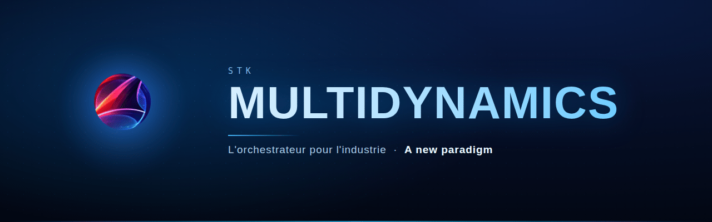

  

**[🇫🇷 Français](#-français)** &nbsp;·&nbsp; **[🇬🇧 English](#-english)** &nbsp;·&nbsp; [**✉️ Contact**](mailto:stk.multidynamics@gmail.com)

---

## ◢ Français

Nous concevons un **orchestrateur** pensé pour l'industrie : superviser, piloter et faire
tenir des systèmes complexes **sans jamais s'arrêter**. Une approche taillée pour la
fiabilité, la souveraineté et la performance — du capteur jusqu'à la salle de contrôle.

> Moins de friction, plus de maîtrise. Une architecture qui reste **vivante** quoi qu'il arrive.

**Ce que nous construisons**
- 🧭 **Supervision émergente** — l'état du système se lit d'un coup d'œil, en continu.
- ⚙️ **Cœur natif** — conçu pour la vitesse et la robustesse, au plus près du matériel.
- 🛡️ **Souveraineté** — 100 % maîtrisé, de bout en bout, sans dépendance subie.
- 🔭 **STK Vision** — l'interface qui donne à voir l'invisible des procédés.

**Pour qui** — Industriels en quête de robustesse · ingénieur·es qui veulent bâtir du solide ·
curieux du prochain paradigme de pilotage.

---

## ◢ English

We design an **orchestrator** built for industry: monitor, drive and keep complex systems
running **without ever stopping**. An approach tailored for reliability, sovereignty and
performance — from the sensor to the control room.

> Less friction, more control. An architecture that stays **alive** no matter what.

**What we build**
- 🧭 **Emergent supervision** — read the whole system state at a glance, continuously.
- ⚙️ **Native core** — engineered for speed and robustness, close to the metal.
- 🛡️ **Sovereignty** — 100% controlled, end to end, no imposed dependency.
- 🔭 **STK Vision** — the interface that reveals the invisible side of processes.

**For whom** — Industrials seeking robustness · engineers who want to build solid ·
the curious about the next control paradigm.

 

**Une idée, un projet, l'envie de rejoindre l'aventure ? — An idea, a project, want to join?**

 

L'ensemble du paradigme STK est <b>protégé au titre de la propriété intellectuelle</b> —
reproduction, ingénierie inverse et réutilisation interdites sans autorisation écrite. 
The entire STK paradigm is <b>protected by intellectual property law</b> — reproduction,
reverse engineering and reuse forbidden without written permission. 
© 2026 STK Multidynamics — Tous droits réservés · All rights reserved.

